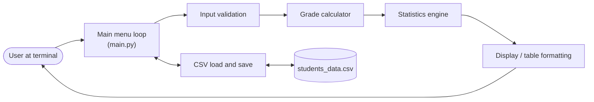
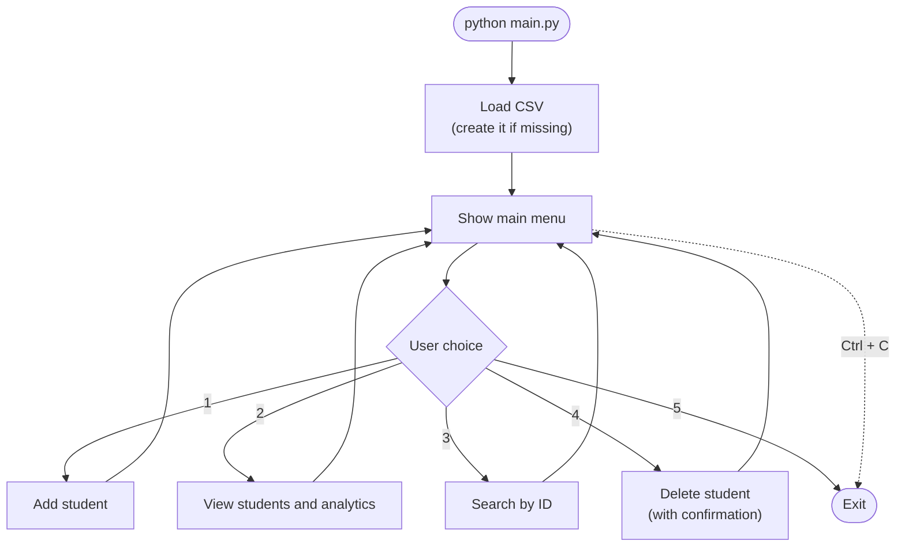
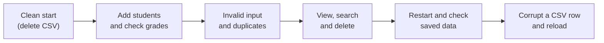

# Student Grade Tracker (Command-Line App)

## Overview

Student Grade Tracker is a small terminal program written in plain Python for recording student marks and seeing how a class is performing. A teacher can add students, and the program automatically assigns a letter grade, calculates class statistics, and saves everything to a CSV file so the data is still there the next time the program is opened. It works fully offline and needs no extra packages.

**System architecture**



## Features

- **Add students**: store a unique ID, a name, and marks between 0 and 100.
- **Automatic grading**: marks are converted to a letter grade using this scale:

  | Marks | Grade |
  | :--- | :---: |
  | 90 – 100 | A+ |
  | 80 – 89.99 | A |
  | 70 – 79.99 | B |
  | 60 – 69.99 | C |
  | 50 – 59.99 | D |
  | Below 50 | F |


  **How a grade is decided**

  ```mermaid
  flowchart TD
      A["Marks entered"] --> B{"Marks >= 90?"}
      B -- Yes --> A1["A+"]
      B -- No --> C{"Marks >= 80?"}
      C -- Yes --> A2["A"]
      C -- No --> D{"Marks >= 70?"}
      D -- Yes --> A3["B"]
      D -- No --> E{"Marks >= 60?"}
      E -- Yes --> A4["C"]
      E -- No --> F{"Marks >= 50?"}
      F -- Yes --> A5["D"]
      F -- No --> A6["F"]
  ```

  **Adding a student (input validation)**

  ```mermaid
  flowchart TD
      S(["Option 1 selected"]) --> I["Enter Student ID"]
      I --> I1{"Empty or<br/>duplicate ID?"}
      I1 -- Yes --> I
      I1 -- No --> N["Enter Name"]
      N --> N1{"Empty name?"}
      N1 -- Yes --> N
      N1 -- No --> K["Enter Marks"]
      K --> K1{"Number between<br/>0 and 100?"}
      K1 -- No --> K
      K1 -- Yes --> G["Calculate grade"]
      G --> W["Save to CSV"]
      W --> Done(["Student added"])
  ```

- **Class report**: total students, average marks and average grade, pass percentage, highest and lowest scorer, and a count of students per grade.
- **Search by ID**: finds a student regardless of upper/lower case.
- **Delete a record**: asks for confirmation before removing anything.
- **Input validation**: rejects empty IDs or names, duplicate IDs, non-numeric marks, and marks outside 0–100. The prompt repeats instead of crashing.
- **Safe file storage**: data is saved to `students_data.csv`. Changes are written to a temporary file first and then swapped in, so an interrupted save does not corrupt the data. If the CSV is missing it is created automatically, and broken rows are skipped when loading.

  **How data is saved safely**

  ```mermaid
  sequenceDiagram
      participant P as Program
      participant T as students_data.csv.tmp
      participant C as students_data.csv
      P->>T: Write all records to temp file
      T-->>P: Write finished
      P->>C: Replace old file with temp file
      Note over P,C: If the program stops during the write,<br/>the original CSV is untouched
  ```

- **Clean exit**: choose option 5 or press `Ctrl + C`.

## Technologies / Tools Used

- **Language:** Python 3.7 or newer
- **Standard library modules:** `os`, `csv`, `sys`, `typing` (no third-party packages)
- **Data storage:** CSV file (`students_data.csv`)
- **Platform:** Windows, macOS, or Linux, run from any terminal
- **Optional:** any text editor or IDE (VS Code, PyCharm, etc.)

## Steps to Install & Run

No installation of libraries is needed. You only need Python.

1. **Check that Python is installed**

   ```bash
   python --version
   ```

   On macOS/Linux use `python3 --version`. If Python is missing, download it from https://www.python.org/ (on Windows, tick *Add Python to PATH* during setup).

2. **Get the project files** (download or clone them) and open the project folder:

   ```bash
   cd student-grade-system
   ```

3. **Run the program**

   ```bash
   python main.py
   ```

   Use `python3 main.py` on macOS/Linux, or `py main.py` on Windows if `python` is not recognised.

4. The main menu appears:

   ```text
   [1] Enroll / Add New Student
   [2] View All Students & Performance Analytics
   [3] Search Student by ID
   [4] Delete Student Record
   [5] Exit Application
   ```

Program flow:



Project layout:

```
student-grade-system/
├── main.py             # the program
├── README.md           # this file
└── students_data.csv   # saved records (created automatically on first run)
```

## Instructions for Testing

The project is tested manually by running the program and checking that each action gives the expected result. Delete `students_data.csv` before you begin so you start with a clean state.

| # | What to do | Expected result |
| :-: | :--- | :--- |
| 1 | Start the program with no CSV file present | Menu appears and a new `students_data.csv` with the header `ID,Name,Marks,Grade` is created |
| 2 | Option 1: add `S1`, `Asha Rao`, `92` | Student is saved with grade **A+** |
| 3 | Add students with marks `85`, `75`, `65`, `55`, `40` | Grades are **A, B, C, D, F** respectively |
| 4 | Boundary check: add marks `90`, `89.99`, `50`, `49.99` | Grades are **A+, A, D, F** |
| 5 | Try to add a student with ID `s1` (same as `S1`, different case) | Rejected as a duplicate ID |
| 6 | Enter an empty ID or empty name | Rejected; prompt repeats |
| 7 | Enter marks `abc`, `-5`, or `101` | Rejected; prompt repeats |
| 8 | Option 2: view all students | Table and analytics show correct count, average, pass rate, highest/lowest scorer, and grade distribution (verify the average by hand) |
| 9 | Option 3: search `s1` (lower case) | Record for `S1` is displayed |
| 10 | Option 3: search an ID that does not exist | "Not found" message, no crash |
| 11 | Option 4: delete a student, answer **no** at the confirmation | Record is kept |
| 12 | Option 4: delete a student, answer **yes** | Record is removed and no longer appears in option 2 |
| 13 | Exit with option 5, run the program again, choose option 2 | Previously saved records are still there (persistence works) |
| 14 | Open `students_data.csv`, break one row (e.g. put text in Marks), restart | Broken row is skipped; the other rows still load |
| 15 | Press `Ctrl + C` at any prompt | Program exits cleanly without an error trace |

Suggested testing order:



If every row above behaves as described, the program is working correctly.
