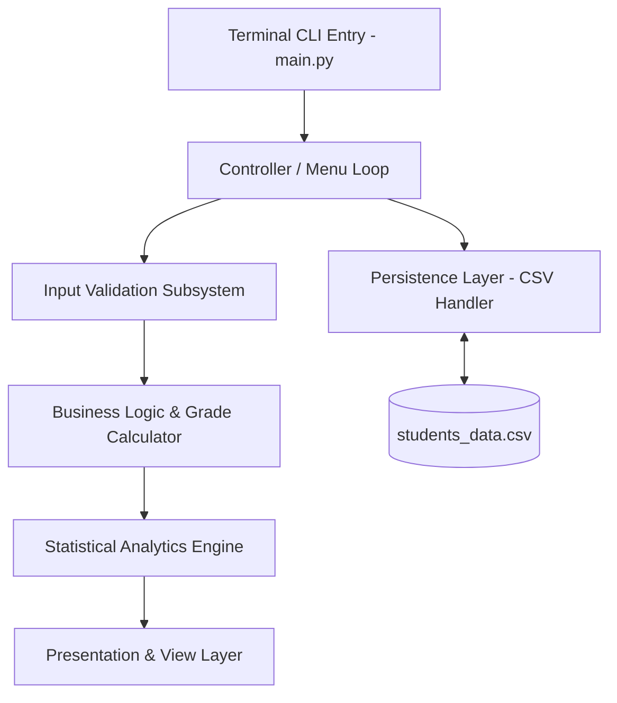

# 🎓 Student Grade Management System (CLI)

[](https://www.python.org/)
[](LICENSE)
[]()
[]()

A robust, enterprise-grade, interactive command-line terminal application engineered in pure Python to manage student academic records, automate letter grade evaluations, generate aggregate performance analytics, and provide safe atomic local data persistence via CSV.

---

## 📑 Table of Contents

1. [Project Overview](#-project-overview)
2. [Architectural Design & Modules](#-architectural-design--modules)
3. [Core Capabilities & Analytics](#-core-capabilities--analytics)
4. [Data Validation & Business Rules](#-data-validation--business-rules)
5. [Local Persistence & Data Recovery](#-local-persistence--data-recovery)
6. [Prerequisites](#-prerequisites)
7. [Step-by-Step Setup & Execution](#-step-by-step-setup--execution)
8. [Sample CLI Outputs](#-sample-cli-outputs)
9. [Project Directory Layout](#-project-directory-layout)
10. [Troubleshooting & FAQ](#-troubleshooting--faq)

---

## 📖 Project Overview

The **Student Grade Management System** provides educational administrators and instructors with an offline-capable, lightweight, and zero-dependency terminal interface. The program guarantees immediate grade calculation, multi-dimensional academic analytics (including class averages, extreme outlier detection, and letter grade breakdowns), and atomic file persistence to eliminate race conditions and data corruption.

---

## 🏗 Architectural Design & Modules

The application is engineered into modular subsystems to ensure maintainability, testability, and high fault tolerance:



### Module Breakdown:
1. **Configuration & Constants**: Centralizes file paths, CSV headers, and grade thresholds.
2. **Core Business Logic**: Implements grading scales and mathematical statistical aggregation routines.
3. **Persistence Layer**: Manages file initialization, atomic file writes (`.tmp` to `.csv` swap), and row-level schema validation.
4. **Input Validation Subsystem**: Loop-based prompt handlers that sanitize inputs against blank values, type mismatches, out-of-range floats, and duplicate IDs.
5. **Presentation Layer**: Formats dynamic ASCII tables, summary analytics dashboards, and interactive alerts.
6. **Controller Loop**: Dispatches user commands, catches system-level interrupts (`Ctrl+C`), and maintains session continuity.

---

## 📊 Core Capabilities & Analytics

- **Record Enrollment**: Capture unique Student IDs, Full Names, and Marks on a 0.00–100.00 scale.
- **Automated Grading Engine**: Instantly computes letter grades based on standard academic distribution.
- **Academic Performance Dashboard**:
  - Total student enrollment counter.
  - Overall class mark average and corresponding class letter grade.
  - Overall class passing percentage rate.
  - Identification of highest and lowest academic achievers.
  - Granular frequency breakdown across all letter grades (`A+` through `F`).
- **Targeted Record Search**: O(N) lookup by Student ID (case-insensitive) with comprehensive student profile rendering.
- **Safe Record Deletion**: Verification prompt prior to committing record removals.

---

## 📐 Data Validation & Business Rules

### 1. Grading Scale Reference

| Marks Range (Percentage) | Letter Grade | Academic Standing |
| :--- | :---: | :--- |
| **90.00% – 100.00%** | `A+` | Outstanding / Distinction |
| **80.00% – 89.99%** | `A` | Excellent |
| **70.00% – 79.99%** | `B` | Good / Commendable |
| **60.00% – 69.99%** | `C` | Satisfactory / Average |
| **50.00% – 59.99%** | `D` | Minimum Passing Grade |
| **0.00% – 49.99%** | `F` | Fail / Unsatisfactory |

### 2. Validation Constraints

- **Student ID**: Non-empty string, must be unique across all existing records (case-insensitive duplicate check).
- **Student Name**: Non-empty string; leading and trailing whitespace is automatically sanitized.
- **Marks Entry**: Valid numerical float or integer strictly within the interval `[0.00, 100.00]`.
- **Duplicate Prevention**: System rejects duplicate IDs at enrollment time to prevent data collision.

---

## 💾 Local Persistence & Data Recovery

Data is stored locally in `students_data.csv` inside the project folder:

```csv
ID,Name,Marks,Grade
STU101,Jane Doe,94.50,A+
STU102,John Smith,78.20,B
STU103,Alex Johnson,88.00,A
```

### Reliability & Fault-Tolerance Features:
- **Automatic Initialization**: If `students_data.csv` is absent, the system creates it with standard headers upon startup.
- **Atomic File Writing**: Writes changes to a temporary file (`students_data.csv.tmp`) and executes an atomic file replace, preventing partial writes if the process is terminated abruptly.
- **Row-Level Error Recovery**: If manual modifications introduce corrupted rows (e.g. non-numeric marks or missing fields), the loader ignores invalid rows and loads all healthy data without crashing.

---

## ⚙️ Prerequisites

- **Python 3.7+** (Works seamlessly with Python 3.8, 3.9, 3.10, 3.11, 3.12+).
- **Operating System**: Windows 10/11, macOS, or Linux.
- **External Dependencies**: None. Built exclusively on Python Standard Libraries (`os`, `csv`, `sys`, `typing`).

---

## 🚀 Step-by-Step Setup & Execution

### Step 1: Verify Python Installation
Open your terminal (PowerShell, Command Prompt, or Terminal) and verify your Python runtime:

```bash
python --version
```
*Note: On Linux or macOS, use `python3 --version`.*

### Step 2: Navigate to Project Directory
Change your working directory to the folder containing the project files:

```bash
cd "student-grade-system"
```

### Step 3: Run the Application
Execute `main.py` directly from the terminal:

```bash
python main.py
```
*(Or `python3 main.py` on macOS/Linux)*

---

## 💻 Sample CLI Outputs

### 1. Main Navigation Menu
```text
======================================================
   🎓  STUDENT GRADE MANAGEMENT SYSTEM (CLI)  🎓   
======================================================
  [1] Enroll / Add New Student
  [2] View All Students & Performance Analytics
  [3] Search Student by ID
  [4] Delete Student Record
  [5] Exit Application
======================================================
 Select an option (1-5): 
```

### 2. Tabular Records & Analytics Dashboard
```text
========================================================================
             STUDENT ACADEMIC REGISTRY & PERFORMANCE SUMMARY             
========================================================================
No.   | Student ID     | Student Name               | Marks      | Grade 
------------------------------------------------------------------------
1     | STU101         | Jane Doe                   | 94.50      | A+    
2     | STU102         | John Smith                 | 78.20      | B     
3     | STU103         | Alice Williams             | 88.00      | A     
4     | STU104         | Bob Martin                 | 54.00      | D     
========================================================================
                       PERFORMANCE ANALYTICS                      
------------------------------------------------------------------------
 Total Enrolled Students : 4
 Class Average Marks     : 78.68 / 100.00 (Grade: B)
 Passing Rate            : 100.0%
 Highest Achiever        : Jane Doe (ID: STU101) - 94.50 marks [A+]
 Lowest Achiever         : Bob Martin (ID: STU104) - 54.00 marks [D]
------------------------------------------------------------------------
 Grade Distribution Breakdown:
  ->  A+: 1 | A: 1 | B: 1 | C: 0 | D: 1 | F: 0
========================================================================
```

### 3. Record Search View
```text
================================================
          SEARCH STUDENT RECORD BY ID           
================================================
Enter Student ID to look up: STU101

 [✓] RECORD MATCH LOCATED:
------------------------------------------------
  • Student ID     : STU101
  • Full Name      : Jane Doe
  • Obtained Marks : 94.50 / 100.00
  • Letter Grade   : A+
------------------------------------------------
```

---

## 📁 Project Directory Layout

```
student-grade-system/
│
├── main.py              # Core application source code and CLI controller
├── README.md            # Comprehensive project documentation and guides
└── students_data.csv    # Local CSV data store (auto-generated on first run)
```

---

## 🔧 Troubleshooting & FAQ

### Q1: `python` command is not recognized in terminal.
- **Resolution (Windows)**: Ensure Python was installed with the option **"Add Python to PATH"** checked. Alternatively, use the Python launcher:
  ```bash
  py main.py
  ```

### Q2: What happens if `students_data.csv` is deleted or moved?
- **Resolution**: The application detects the missing file upon startup and automatically creates a fresh, correctly formatted CSV file.

### Q3: How do I exit the program safely?
- **Resolution**: Choose option `[5]` from the menu, or press `Ctrl + C` at any prompt. The program catches the interrupt and terminates cleanly.

### Q4: Are there any third-party GUI or library requirements?
- **Resolution**: No. The system runs 100% natively in any terminal with pure standard Python.
